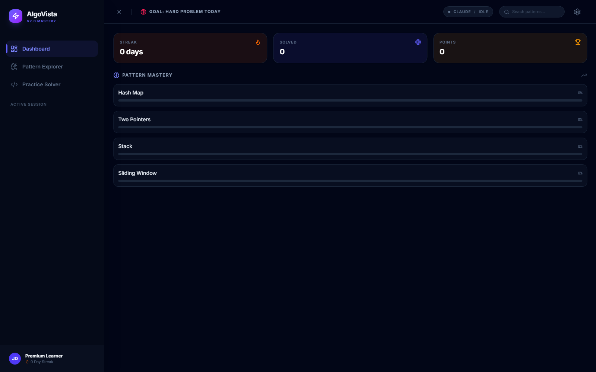
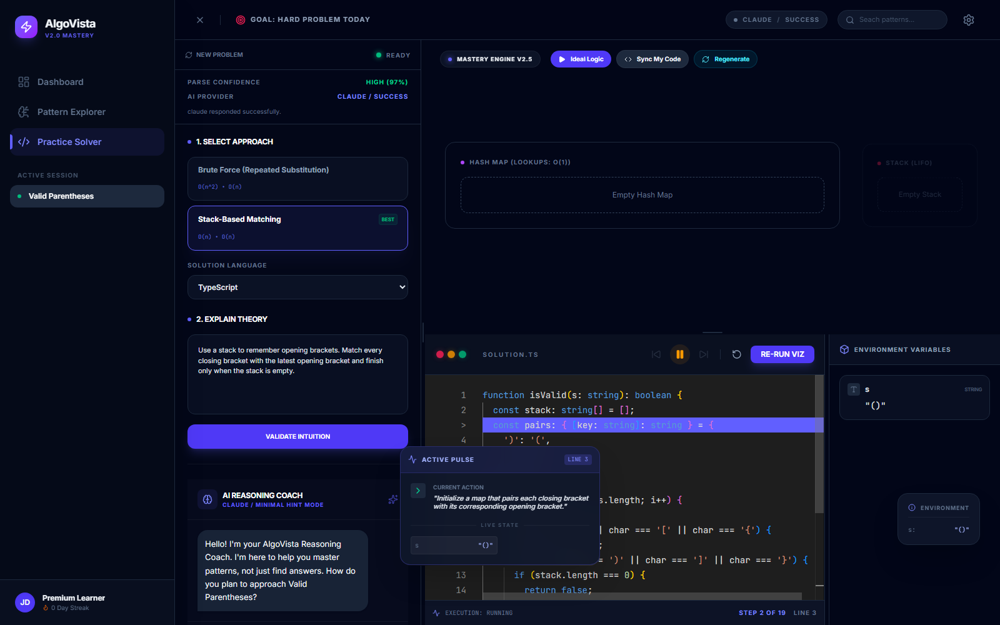
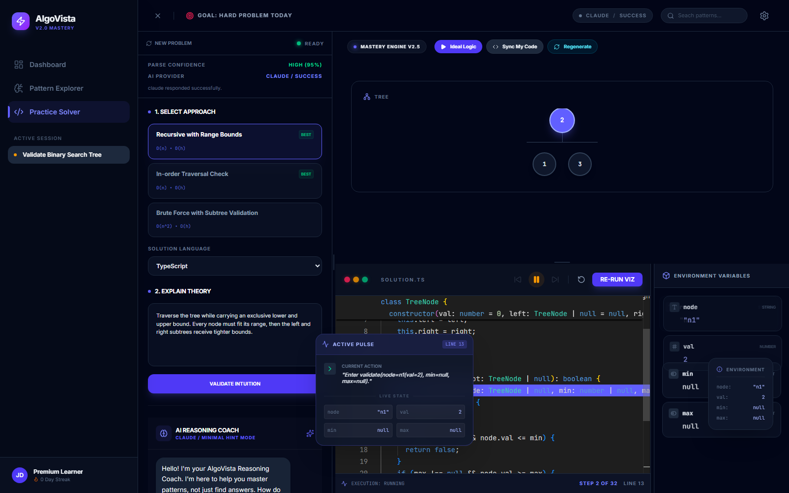
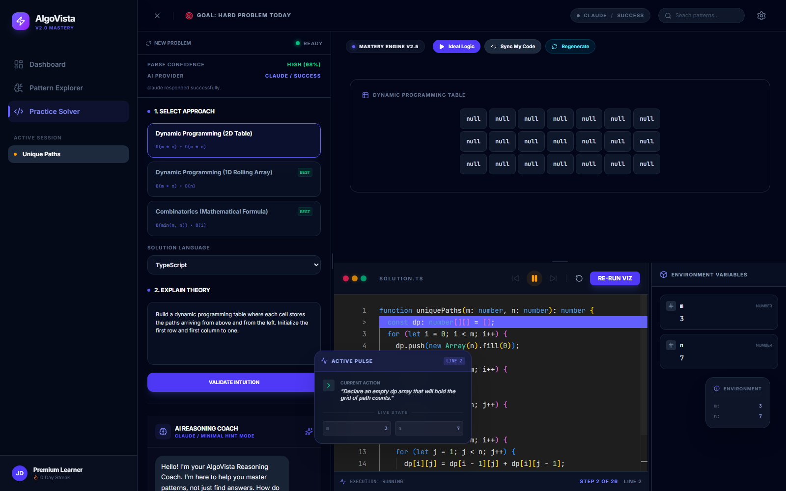

<h1 align="center">AlgoVista</h1>

<p align="center">
  <strong>Learn algorithms by seeing the reasoning, code, and state change together.</strong>
</p>

<p align="center">
  An AI-assisted workspace that turns algorithm problems into guided, visual learning sessions.
</p>

<p align="center">
  
  
  
  
</p>

<p align="center">
  <a href="#learning-workflow">Workflow</a> ·
  <a href="#main-features">Features</a> ·
  <a href="#see-algovista-in-action">Screenshots</a> ·
  <a href="#installation">Installation</a> ·
  <a href="#ai-provider-behavior">AI providers</a>
</p>

<p align="center">
  
</p>

AlgoVista makes the invisible parts of solving an algorithm problem easier to understand. It brings problem parsing, approach selection, guided reasoning, code, execution traces, and structure-aware visualization into one focused workspace.

The experience is reasoning-first. You explain an approach before the editor unlocks, then compare that thinking with an executable trace and a matching data-structure visualization.

## Learning workflow

1. Enter a LeetCode URL, problem number, or pasted problem statement.
2. Let an AI provider parse the problem, examples, constraints, starter code, and possible approaches.
3. Select an approach and review its expected time and space complexity.
4. Explain your reasoning before writing code.
5. Unlock the Monaco editor and work in TypeScript, Python, C++, Java, C, or Ruby.
6. Run Ideal Logic to generate matching solution code and a trace, or use Sync My Code to trace your current code without replacing it.
7. Move through the trace manually or use playback controls.
8. Inspect the visualization, active source line, explanation, and variable state at each step.

## Main features

- Problem loading from LeetCode links, problem numbers, and pasted text
- AI-assisted parsing with confidence reporting and user confirmation for uncertain input
- Approach suggestions with complexity information
- A reasoning-first editor unlock flow
- Monaco-based editing for TypeScript, Python, C++, Java, C, and Ruby
- Ideal solution generation for the selected approach and language
- User-code tracing that preserves manually written or edited code
- Validated source-line references that keep code and trace highlights aligned
- Step controls with play, pause, previous, next, and reset
- Variable inspection alongside the active visualization
- AI coaching focused on hints and reasoning instead of immediately providing code
- Configurable primary and fallback AI providers with visible provider status
- Persistent, validated result caching that avoids unnecessary provider requests
- Persisted workspace state, panel layout, AI settings, and learning progress

AlgoVista supports eight visualization categories:

| Category | Visualized state |
| --- | --- |
| Array | Values, highlighted elements, and named pointers or indices |
| Hash map | Key-value entries used for insertion and lookup |
| Stack | Items ordered from bottom to top |
| Queue | Items ordered from front to back |
| Tree | Nodes, child relationships, traversal state, and the active node |
| Graph | Nodes, edges, direction, visited nodes, and traversed edges |
| DP table | Rectangular values, labels, active cells, and highlighted cells |
| Linked list | Singly linked nodes, the head, pointer relationships, and active nodes |

## See AlgoVista in action

These screenshots were captured from real AlgoVista sessions running through the normal problem, reasoning, solution, and trace flow.

### Follow a stack algorithm line by line

Valid Parentheses uses stack-based matching. The editor, current action, variables, and visual state all advance from the same execution step.

<p align="center">
  
</p>

### See recursion move through a tree

Validate Binary Search Tree carries lower and upper bounds through each recursive call. The active node and call variables stay beside the highlighted source line.

<p align="center">
  
</p>

### Watch a dynamic programming table fill

Unique Paths builds a two-dimensional table while the editor explains the update that produced each state.

<p align="center">
  
</p>

## Tech stack

- React 19
- TypeScript 5.8
- Vite 6
- Zustand 5 with persisted browser state
- Monaco Editor
- Tailwind CSS 4
- Motion for interface animation
- React Resizable Panels for the workspace layout
- Three.js and React Three Fiber dependencies for visualization support
- Google Gemini, OpenAI, and Anthropic Claude integrations
- Node's test runner with `tsx`

## Prerequisites

- Node.js 18 or newer
- npm
- At least one supported AI provider API key

## Installation

Clone the repository and install its dependencies:

```bash
git clone https://github.com/dhrish-s/AlgoVista.git
cd AlgoVista
npm install
```

## Environment configuration

Copy the example environment file:

```bash
cp .env.example .env.local
```

On Windows PowerShell, use:

```powershell
Copy-Item .env.example .env.local
```

Add at least one provider key to `.env.local`:

```env
VITE_GEMINI_API_KEY="your_gemini_key"
VITE_OPENAI_API_KEY="your_openai_key"
VITE_CLAUDE_API_KEY="your_claude_key"
```

Gemini also accepts the earlier environment variable name for backward compatibility:

```env
GEMINI_API_KEY="your_gemini_key"
```

Model names can be overridden when needed:

```env
VITE_GEMINI_MODEL="gemini-3-flash-preview"
VITE_OPENAI_MODEL="gpt-4o-mini"
VITE_CLAUDE_MODEL="claude-sonnet-5"
```

Configure the initial primary and fallback providers with `gemini`, `openai`, or `claude`:

```env
VITE_AI_PROVIDER="gemini"
VITE_FALLBACK_AI_PROVIDER="gemini"
```

Gemini is the default when no valid provider value is supplied. Only providers with configured API keys are available in the settings panel.

Environment values provide the initial AI settings. AlgoVista persists provider choices and model names in browser `localStorage` under `algovista-storage`. Once current-version settings have been saved, those browser settings take precedence over environment defaults on later loads. The versioned persistence migration refreshes outdated model names when the stored schema version changes. To apply a different model immediately, update it in the settings panel or remove the saved `algovista-storage` entry.

The development server also recognizes `DISABLE_HMR=true` when hot module replacement needs to be disabled.

The example file includes `APP_URL` as reserved deployment metadata. The current frontend does not read this value.

## API key security

AlgoVista currently calls AI provider APIs directly from the browser. Every `VITE_*` value used by the frontend is included in the client bundle and can be inspected by a user of the application. The legacy `GEMINI_API_KEY` alias is also passed into the browser build.

Use browser-direct keys only for local development, demos, or controlled portfolio deployments. Do not commit `.env.local`, share unrestricted keys, or use privileged production credentials in the frontend.

For a production deployment, route AI requests through a backend service. Keep provider credentials on the server, authenticate application users, apply rate limits, and restrict provider usage according to the deployment's needs.

## Running locally

Start the development server:

```bash
npm run dev
```

Open [http://localhost:3000](http://localhost:3000) in a browser.

To test the production build locally:

```bash
npm run build
npm run preview
```

## Available scripts

| Command | Purpose |
| --- | --- |
| `npm run dev` | Start Vite on port 3000 and listen on all network interfaces |
| `npm run build` | Create the production bundle with Vite |
| `npm run preview` | Serve the production bundle for local inspection |
| `npm run clean` | Remove the generated `dist` directory |
| `npm run lint` | Run `tsc --noEmit` for TypeScript type checking |
| `npm test` | Run the complete automated test suite with `tsx` and Node's test runner |

There is no separate `typecheck` script. The `lint` script is the project's TypeScript check.

## Project structure

```text
AlgoVista/
  src/
    components/                 Workspace panels and application UI
      visualizer/               Main visualization container and routing
      visualizers/              Eight data-structure visualizers and shared UI
    services/                   Problem loading, trace validation, and snapshot folding
      ai/                       Provider manager, configuration, and provider types
        providers/              Gemini, OpenAI, and Claude adapters
      cache/                    Validated result cache, identities, and storage
    store/                      Zustand state, persistence, and migrations
    lib/                        Shared formatting and class-name utilities
    types.ts                    Problem, execution-step, and visualization contracts
    App.tsx                     Main application shell
  tests/                        Validation, provider, persistence, and rendering tests
  .env.example                  Environment configuration template
  vite.config.ts                Vite, React, Tailwind, environment, and server setup
  package.json                  Dependencies and project scripts
```

The structure-specific trace resolvers and validators live in `src/services/`. They validate provider output and precompute full snapshots before execution steps enter Zustand, so direct navigation to any step does not need to replay the trace in the interface.

## AI provider behavior

AlgoVista supports Gemini, OpenAI, and Claude. Each provider can parse problems, generate solutions in all six supported languages, handle coaching conversations, and generate execution steps. Some advanced helper actions, including dedicated reasoning evaluation, hint generation, and code explanation, remain Gemini-first. The provider manager can route tasks to a selected provider, retry failures, use a configured fallback, report the provider that handled the request, and cancel requests that exceed their operation deadline.

All three providers use the same execution-step fields and operation types. Supported operation types are `init`, `compare`, `move-pointer`, `swap`, `insert-map`, `lookup-map`, `push-stack`, `pop-stack`, `enqueue`, `dequeue`, `visit-node`, `update-dp`, `recurse-call`, `recurse-return`, `window-expand`, `window-shrink`, `return`, `found`, and `assign`.

All providers can emit each of the eight visualization categories. Trace storage depends on the structure:

| Categories | Provider trace format |
| --- | --- |
| Array, hash map, stack, queue | The complete visual state is sent with each step. These states are already small and direct. |
| Tree, graph, DP table, linked list | The full structure is sent once as a base. Each step then sends only structural, pointer, value, active-state, or highlight changes. |

The compact format prevents large structures from being repeated across every step. This reduces provider output size and lowers the chance of reaching output token limits on larger traces. AlgoVista validates and folds these changes into complete immutable snapshots before storing the trace. A malformed compact base rejects the provider attempt and allows fallback. An invalid later delta is skipped while the next valid delta continues from the last accepted snapshot.

Timeouts match the expected response size of each operation:

| Operation | Deadline |
| --- | --- |
| Problem parsing | 45 seconds |
| Solution generation | 45 seconds |
| Step generation and Sync My Code | 180 seconds |
| Small helper operations | 30 seconds |

Large traces receive more time without losing hung-request protection. Caller cancellation, problem changes, and component unmounting still abort in-flight generation immediately. Provider API errors, timeout errors, and output truncation are surfaced with specific messages instead of leaving the interface in an indefinite loading state.

### Result caching

AlgoVista caches validated problem parses, generated solutions, and execution traces in IndexedDB. Cache keys include the inputs that affect correctness, such as the problem, approach, source code, language, trace mode, provider, model, and contract version. Duplicate requests already in progress are shared instead of being sent twice.

The persistent cache is capped at 25 MiB and removes least-recently-used entries when space is needed. Invalid or outdated entries are rejected before reuse. Use **Clear cached results** in settings to remove saved results, or choose **Re-run Viz** to request a fresh trace while keeping the current solution code.

## Current notes and limitations

- Execution traces are limited to 50 accepted steps. Longer traces show the first reliable portion.
- Tree rendering is limited to 100 nodes.
- Graph rendering is limited to 100 nodes and 300 edges.
- DP-table rendering is limited to 2,500 cells.
- Linked-list rendering is limited to 100 nodes and supports singly linked lists only.
- Linked-list cycles are shown with a back-reference indicator instead of a full graph layout.
- Low-confidence problem parsing asks for clearer input or user confirmation instead of guessing.
- Advanced reasoning evaluation, dedicated hint generation, and code explanation are Gemini-first. OpenAI and Claude still support parsing, coaching, and execution-step generation.
- Browser-direct OpenAI or Claude requests can be affected by browser or provider cross-origin restrictions. A backend proxy is recommended for production.
- The production JavaScript bundle exceeds Vite's advisory chunk-size threshold. Code splitting is not yet configured.
- `npm run lint` performs TypeScript checking only. The project does not currently run ESLint or another dedicated style and code-quality linter.
